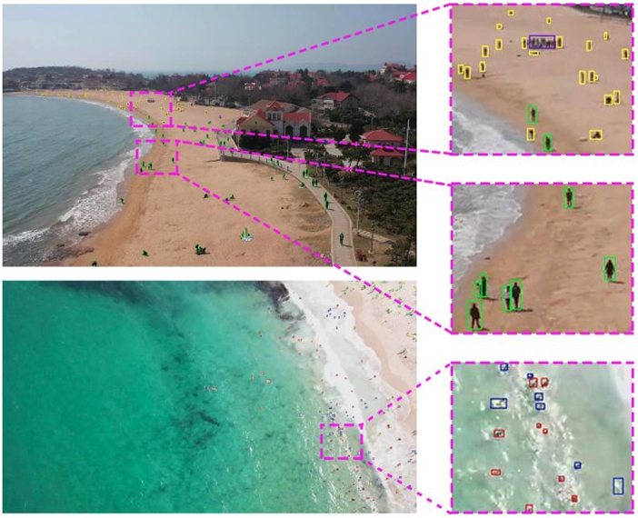
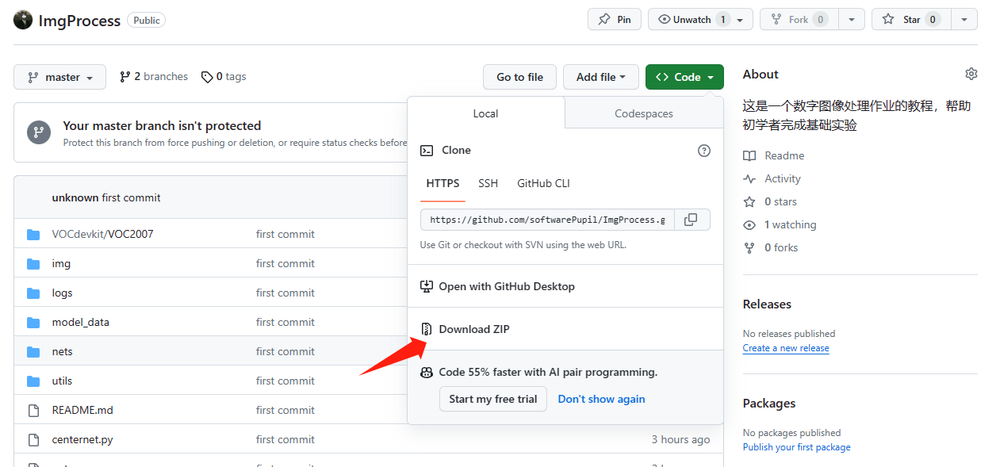
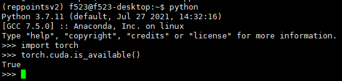
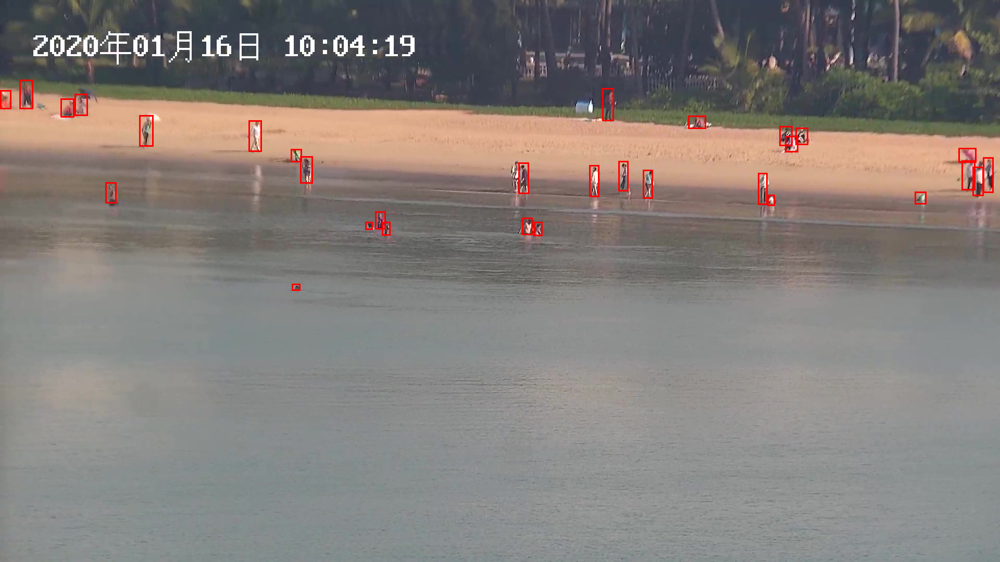

<a name="FtQ82"></a>
# 数字图像处理作业
<a name="ResGY"></a>
## 项目简介
这是一个数字图像处理作业的教程，希望同学们利用深度学习目标检测框架实现微小目标检测任务。<br /><br />如果你是一位深度学习方向的老玩家😎，那么这个教程你不必在意，我想你肯定有更好的办法完成作业。如果你是一位新手玩家🤩，那么这个教程将会手把手的指导你如何利用深度学习目标检测框架完成目标检测任务。
<a name="SEZMX"></a>
## 设备说明
如果你拥有可以随时使用的Ubuntu系统服务器或者Ubuntu系统的独显电脑，那么问题将会变得十分简单。如果你只有Windows系统的电脑并且没有独显，那么也可以进行实验。之后的步骤默认你使用的时ubuntu系统，如果你使用的是Windows，请详细参考“**特殊情况**”。<br />本教程会给同学们提供预训练权重，是我用一套随机初始化的参数训练50代的模型权重。特别的，虽然这个模型权重性能表现一般，但我想这个权重一定可以帮到你✌️。
<a name="rZPmZ"></a>
## 配置环境
<a name="VJusC"></a>
### 环境说明
考虑到大家的设备环境，本实验代码适应pytorch1.2~1.6，cuda版本9.0，10.0，10.1，10.2，python版本3.6~3.8。在这之前确保你的电脑安装了显卡驱动、cuda、cudnn。参考教程：
```
https://blog.csdn.net/zxdd2018/article/details/127705627
```
此类的安装教程CSDN/Bilibili有很多，大家可以根据自己系统的型号选择具体的教程。<br />安装conda教程：
```
https://blog.csdn.net/sang_12345/article/details/125798317
```
如果你的电脑不支持显卡运算，那么可以是用CPU进行模型的微调，这部分请参考“**特殊情况**”。
<a name="q65Ff"></a>
### 安装
最好使用校园网！<br />创建虚拟环境（我们使用的模型是CenterNet网络）
```
conda create --name CenterNet python=3.6 -y
```
进入虚拟环境
```
conda activate CenterNet
```
挑选一个合适的路径（路径根据自己需要设置）
```
cd ~/your/self/path/
```
git clone本项目，当然你也可以手动下载zip并解压本项目在你需要的目录下，进入解压后的项目中
```
git clone https://github.com/softwarePupil/ImgProcess.git
cd ImgProcess
```
<br />安装所需要的环境（-i 后面添加的是国内镜像源，参考[https://zhuanlan.zhihu.com/p/623325525](https://zhuanlan.zhihu.com/p/623325525)）
```
pip install -r requirements.txt -i https://pypi.tuna.tsinghua.edu.cn/simple
pip install future -i https://pypi.tuna.tsinghua.edu.cn/simple
```
检查自己的GPU是否可以使用，结果如图：
```
python #进入python编译器
import torch
torch.cuda.is_available()
```
<br />返回True表示GPU可以使用。
<a name="Djnyr"></a>
## 训练数据
<a name="gPQli"></a>
### 准备数据集
首先下载数据集，你可以通过作业说明中的云盘，也可以通过百度网盘。<br />将下载好的名为VOC2007数据集放入**项目工程中的VOCdevkit目录中**。
<a name="u93E6"></a>
### 下载权重
```
voc预训练权重：
50代预训练权重：
```
预训练权重全部放入model_data目录中。
<a name="uJjUV"></a>
### 开始训练
在训练开始前我们需要先理解train.py中的参数。
```
#预训练权重，建议选择resnet50，占用显存少，或者选用预训练'model_data/centernet_resnet50_pertrain.pth'
model_path      = 'model_data/centernet_resnet50_voc.pth'
#输入图像大小，图像首先被0像素填充成为正方形之后再缩放为800×800的尺寸
input_shape     = [800, 800]
#训练代数，这个可以根据你的设备和时间进行调节
UnFreeze_Epoch      = 12
#批处理大小
Unfreeze_batch_size = 4
```
更多参数含义见train.py的注释。<br />开始训练（CUDA_VISIBLE_DEVICES=0代表只是用0号卡，不设置默认使用所有显卡）
```
CUDA_VISIBLE_DEVICES=0 python train.py
```
在训练的时候，会有一些warning，如果你使用了预训练权重那么不必在意。<br />训练的模型保存在logs中，并且最好的一代备注为"best_epoch_weights.pth"。
<a name="bxOuh"></a>
## 可视化结果
在你的logs中找到最好的权重"best_epoch_weights.pth"<br />修改centernet.py文件里面的model_path
```
"model_path"        : 'logs/last_epoch_weights.pth',
```
你可以挑选若干张图像放入img文件夹中，运行predict.py，在img_out中查看可视化结果
```
python predict.py
```

<a name="kuy6N"></a>
## 测试集结果生成
<a name="ueBuC"></a>
### 每张图像的测试结果
测试集的图片已经包含在了"/VOCdevkit/VOC2007/JPEGImages"中。<br />所以只需要运行"get_map.py"函数，就可以得到测试集结果
```
python get_map.py
```
在目录中出现"/map_out/detection-results"中存放了测试集的所有输出结果的txt。
<a name="JyhH3"></a>
### 结果合并
运行test2json.py，将每个txt结果合并成为josn。在目录中出现“results.json”。
```
python test2json.py
```
如果你想提交这版结果，那么请修改json文件的名称，"学号_次数.json"
<a name="TSAoM"></a>
## 特殊情况
如果你是Windows系统，那么不同的电脑配置环境会有不同的bug😢，这些bug大部分会有CSDN解答。<br />这是其中一个windows安装显卡驱动、cuda、cudnn的教程：
```
https://blog.csdn.net/qq_40968179/article/details/128996692
```
但是对于一个初学者，在windows环境下安装显卡驱动、cuda、cudnn是一个挑战。<br />下面提供一种可行的方法，可以不使用GPU运算，而是用预训练权重微调，或者直接推理。当然这种方法优化空间有限，但是在设备不允许的情况下是一种可行的办法。
